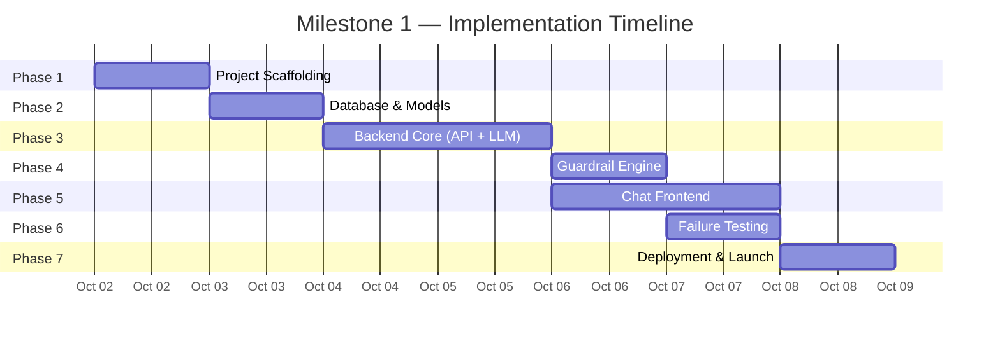
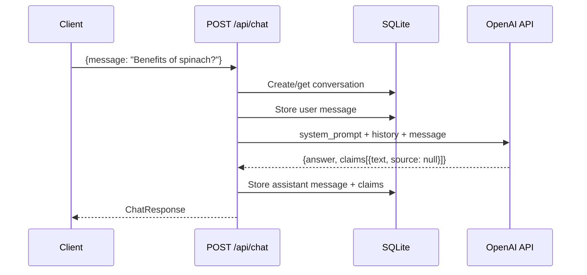
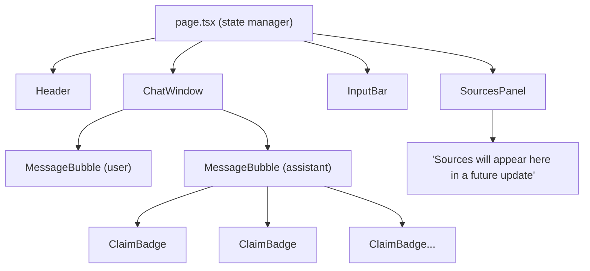
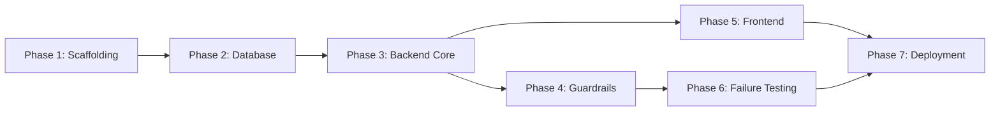

# Implementation Plan: AI Nutrition Assistant (Milestone 1)

> Derived from [problemStatement.md](file:///Users/kaushalyasasikumar/Documents/Nutrition%20project/docs/problemStatement.md) and [architecture.md](file:///Users/kaushalyasasikumar/Documents/Nutrition%20project/docs/architecture.md)

---

## Overview

This plan breaks Milestone 1 into **6 sequential phases**. Each phase is self-contained with clear inputs, outputs, deliverables, and acceptance criteria. The phases are ordered by dependency — each builds on the artefacts of the previous one.



---

## Phase 1: Project Scaffolding & Configuration

**Goal:** Set up the monorepo structure, install dependencies, configure environment, and initialise version control.

### Tasks

| #   | Task                                          | File(s)                              |
| --- | --------------------------------------------- | ------------------------------------ |
| 1.1 | Create root project directory structure       | `nutrition-assistant/`               |
| 1.2 | Initialise Next.js app in `frontend/`         | `npx create-next-app@latest ./`      |
| 1.3 | Initialise FastAPI project in `backend/`      | `backend/app/main.py`               |
| 1.4 | Create `requirements.txt` with dependencies   | `backend/requirements.txt`          |
| 1.5 | Create `.env.example` with all env vars        | `backend/.env.example`              |
| 1.6 | Set up `config.py` with Pydantic Settings     | `backend/app/config.py`             |
| 1.7 | Create `.gitignore` (Python + Node + .env)    | `.gitignore`                         |
| 1.8 | Initialise Git repo and push to GitHub        | —                                    |
| 1.9 | Create root `README.md`                       | `README.md`                          |

### Dependencies (Python — `requirements.txt`)

```
fastapi>=0.104.0
uvicorn[standard]>=0.24.0
sqlalchemy>=2.0.0
openai>=1.6.0
pydantic>=2.5.0
pydantic-settings>=2.1.0
python-dotenv>=1.0.0
```

### Dependencies (Node — `package.json` additions)

```
(created by create-next-app, no extras needed for M1)
```

### Config Setup

```python
# backend/app/config.py
from pydantic_settings import BaseSettings

class Settings(BaseSettings):
    openai_api_key: str
    database_url: str = "sqlite:///./nutrition.db"
    environment: str = "development"
    cors_origins: str = "http://localhost:3000"
    log_level: str = "info"

    class Config:
        env_file = ".env"

settings = Settings()
```

### Acceptance Criteria

- [ ] `frontend/` runs with `npm run dev` → shows default Next.js page at `localhost:3000`
- [ ] `backend/` runs with `uvicorn app.main:app --reload` → returns `{"status": "ok"}` at `localhost:8000/health`
- [ ] `.env.example` documents all required environment variables
- [ ] GitHub repo created with initial commit

---

## Phase 2: Database & Models

**Goal:** Define the SQLAlchemy models, create the database engine, and verify table creation.

### Tasks

| #   | Task                                          | File(s)                              |
| --- | --------------------------------------------- | ------------------------------------ |
| 2.1 | Create SQLAlchemy `Base` and engine setup     | `backend/app/models/database.py`    |
| 2.2 | Define `Conversation` model                   | `backend/app/models/database.py`    |
| 2.3 | Define `Message` model with FK to Conversation| `backend/app/models/database.py`    |
| 2.4 | Define `Claim` model with FK to Message       | `backend/app/models/database.py`    |
| 2.5 | Define `FailureLog` model                     | `backend/app/models/database.py`    |
| 2.6 | Add `get_session` dependency for FastAPI      | `backend/app/models/database.py`    |
| 2.7 | Wire DB initialisation into `main.py` startup | `backend/app/main.py`               |

### Database Schema (Reference)

```
conversations:  id (PK), created_at, updated_at
messages:       id (PK), conversation_id (FK), role, content, created_at
claims:         id (PK), message_id (FK), claim_text, source (nullable)
failure_logs:   id (PK), test_question_id, category, question, response_snapshot, failure_type, run_number, logged_at
```

### Acceptance Criteria

- [ ] Running the server auto-creates `nutrition.db` with all 4 tables
- [ ] Can manually insert and query a conversation → message → claim chain
- [ ] `get_session` yields a working SQLAlchemy session for dependency injection

---

## Phase 3: Backend Core — API Endpoints & LLM Integration

**Goal:** Build the chat endpoint, integrate the OpenAI API with structured output, and wire up persistence.

### Sub-Phase 3A: Pydantic Schemas & System Prompt

| #    | Task                                         | File(s)                                |
| ---- | -------------------------------------------- | -------------------------------------- |
| 3A.1 | Define `ChatRequest` Pydantic model          | `backend/app/schemas/request.py`      |
| 3A.2 | Define `ClaimSchema` Pydantic model          | `backend/app/schemas/response.py`     |
| 3A.3 | Define `ChatResponse` Pydantic model         | `backend/app/schemas/response.py`     |
| 3A.4 | Write the system prompt                      | `backend/app/prompts/system_prompt.py` |

**Schemas:**

```python
# request.py
class ChatRequest(BaseModel):
    conversation_id: str | None = None
    message: str

# response.py
class ClaimSchema(BaseModel):
    text: str
    source: str | None = None  # Always null in M1

class ChatResponse(BaseModel):
    conversation_id: str
    message_id: str
    answer: str
    claims: list[ClaimSchema]
    guardrail_triggered: bool = False
    guardrail_reason: str | None = None
```

### Sub-Phase 3B: LLM Service

| #    | Task                                         | File(s)                                |
| ---- | -------------------------------------------- | -------------------------------------- |
| 3B.1 | Create OpenAI client initialisation          | `backend/app/services/llm_service.py` |
| 3B.2 | Define the JSON schema for structured output | `backend/app/services/llm_service.py` |
| 3B.3 | Implement `get_llm_response()` function      | `backend/app/services/llm_service.py` |
| 3B.4 | Add conversation history formatting          | `backend/app/services/llm_service.py` |
| 3B.5 | Validate and enforce `source: null` on claims| `backend/app/services/llm_service.py` |

**Key Implementation Detail:**

```python
async def get_llm_response(messages: list[dict]) -> dict:
    response = client.chat.completions.create(
        model="gpt-4o",
        messages=messages,
        response_format={
            "type": "json_schema",
            "json_schema": { ... }  # As defined in architecture.md §5.3
        }
    )
    parsed = json.loads(response.choices[0].message.content)

    # M1 enforcement: null out any non-null sources
    for claim in parsed.get("claims", []):
        claim["source"] = None

    return parsed
```

### Sub-Phase 3C: Chat Router & Endpoint

| #    | Task                                         | File(s)                                |
| ---- | -------------------------------------------- | -------------------------------------- |
| 3C.1 | Create `POST /api/chat` endpoint             | `backend/app/routers/chat.py`         |
| 3C.2 | Create `POST /api/conversations` endpoint    | `backend/app/routers/chat.py`         |
| 3C.3 | Create `GET /api/conversations/{id}` endpoint| `backend/app/routers/chat.py`         |
| 3C.4 | Wire persistence (save message + claims)     | `backend/app/routers/chat.py`         |
| 3C.5 | Configure CORS in `main.py`                  | `backend/app/main.py`                 |
| 3C.6 | Register router in `main.py`                 | `backend/app/main.py`                 |

### Request Flow (Phase 3 — without guardrails)



### Acceptance Criteria

- [ ] `POST /api/chat` returns a valid `ChatResponse` with `answer` and `claims`
- [ ] All `claims[].source` values are `null`
- [ ] Conversation history is stored in SQLite and retrievable via `GET /api/conversations/{id}`
- [ ] System prompt enforces role, formatting, and boundaries
- [ ] CORS allows requests from `localhost:3000`

---

## Phase 4: Guardrail Engine (Code-Enforced)

**Goal:** Implement the pre-LLM filtering system that blocks prohibited topics via application code.

### Tasks

| #   | Task                                          | File(s)                                |
| --- | --------------------------------------------- | -------------------------------------- |
| 4.1 | Define `GuardrailCategory` enum               | `backend/app/services/guardrails.py`  |
| 4.2 | Define `GuardrailResult` dataclass            | `backend/app/services/guardrails.py`  |
| 4.3 | Implement regex patterns for calorie/weight targets | `backend/app/services/guardrails.py` |
| 4.4 | Implement regex patterns for body weight recs | `backend/app/services/guardrails.py`  |
| 4.5 | Implement regex patterns for medical advice   | `backend/app/services/guardrails.py`  |
| 4.6 | Define refusal messages per category          | `backend/app/services/guardrails.py`  |
| 4.7 | Implement `check_guardrails()` function       | `backend/app/services/guardrails.py`  |
| 4.8 | Integrate guardrails into `POST /api/chat`    | `backend/app/routers/chat.py`        |
| 4.9 | Write unit tests for guardrail patterns       | `backend/tests/test_guardrails.py`   |

### Guardrail Pattern Coverage

| Category                  | Patterns to Match                                                    |
| ------------------------- | -------------------------------------------------------------------- |
| Calorie / weight targets  | "how many calories should I", "caloric intake for me", "daily calories for" |
| Body weight recommendations | "ideal weight for", "how much should I weigh", "what should my BMI be" |
| Medical advice            | "should I take [supplement]", "treat my [condition]", "prescribe"   |

### Integration Point

```python
# In POST /api/chat handler:
guardrail = check_guardrails(request.message)
if guardrail.blocked:
    # Skip LLM call, return refusal directly
    return ChatResponse(
        answer=guardrail.reason,
        claims=[],
        guardrail_triggered=True,
        guardrail_reason=guardrail.category.value
    )
# else: proceed to LLM
```

### Unit Tests

```python
# backend/tests/test_guardrails.py

def test_blocks_calorie_targets():
    result = check_guardrails("How many calories should I eat per day?")
    assert result.blocked is True
    assert result.category == GuardrailCategory.CALORIE_WEIGHT_TARGET

def test_blocks_weight_recommendation():
    result = check_guardrails("What is the ideal weight for a 5'8 male?")
    assert result.blocked is True
    assert result.category == GuardrailCategory.BODY_WEIGHT_RECOMMENDATION

def test_blocks_medical_advice():
    result = check_guardrails("Should I take iron supplements for my anemia?")
    assert result.blocked is True
    assert result.category == GuardrailCategory.MEDICAL_ADVICE

def test_allows_general_nutrition():
    result = check_guardrails("What vitamins are in spinach?")
    assert result.blocked is False

def test_allows_food_safety():
    result = check_guardrails("How long can I store cooked chicken in the fridge?")
    assert result.blocked is False
```

### Acceptance Criteria

- [ ] Calorie/weight target questions return a refusal without calling the LLM
- [ ] Body weight recommendation questions return a refusal without calling the LLM
- [ ] Medical advice questions return a refusal without calling the LLM
- [ ] Legitimate nutrition questions pass through to the LLM
- [ ] All unit tests pass
- [ ] Guardrail responses include `guardrail_triggered: true` and `guardrail_reason`

---

## Phase 5: Chat Frontend

**Goal:** Build the Next.js chat interface with message list, input bar, and sources panel.

### Sub-Phase 5A: Design System & Layout

| #    | Task                                         | File(s)                                |
| ---- | -------------------------------------------- | -------------------------------------- |
| 5A.1 | Define CSS variables (colors, typography, spacing) | `frontend/app/globals.css`       |
| 5A.2 | Import Google Font (Inter)                   | `frontend/app/layout.tsx`             |
| 5A.3 | Create two-column layout (chat + sources)    | `frontend/app/page.tsx`               |
| 5A.4 | Add responsive breakpoints                   | `frontend/app/globals.css`            |

**Layout Structure:**

```
┌──────────────────────────────────────────────────────┐
│  Header: NutriBot — AI Nutrition Assistant            │
├─────────────────────────────┬────────────────────────┤
│                             │                        │
│     Chat Window             │    Sources Panel       │
│     (messages scroll)       │    (empty in M1)       │
│                             │                        │
│                             │                        │
├─────────────────────────────┤                        │
│  [ Input Bar         ] [▶]  │                        │
└─────────────────────────────┴────────────────────────┘
```

### Sub-Phase 5B: TypeScript Types & API Client

| #    | Task                                         | File(s)                                |
| ---- | -------------------------------------------- | -------------------------------------- |
| 5B.1 | Define `Message`, `Claim`, `ChatResponse` types | `frontend/lib/types.ts`            |
| 5B.2 | Implement `sendMessage()` API function       | `frontend/lib/api.ts`                 |
| 5B.3 | Implement `getConversation()` API function   | `frontend/lib/api.ts`                 |
| 5B.4 | Implement `createConversation()` API function| `frontend/lib/api.ts`                 |

**Types:**

```typescript
// frontend/lib/types.ts

interface Claim {
  text: string;
  source: string | null;
}

interface Message {
  id: string;
  role: "user" | "assistant";
  content: string;
  claims: Claim[];
  guardrail_triggered?: boolean;
}

interface ChatResponse {
  conversation_id: string;
  message_id: string;
  answer: string;
  claims: Claim[];
  guardrail_triggered: boolean;
  guardrail_reason?: string;
}
```

### Sub-Phase 5C: UI Components

| #    | Task                                         | File(s)                                |
| ---- | -------------------------------------------- | -------------------------------------- |
| 5C.1 | Build `ChatWindow` component                 | `frontend/components/ChatWindow.tsx`  |
| 5C.2 | Build `MessageBubble` component              | `frontend/components/MessageBubble.tsx`|
| 5C.3 | Build `ClaimBadge` component                 | `frontend/components/ClaimBadge.tsx`  |
| 5C.4 | Build `InputBar` component                   | `frontend/components/InputBar.tsx`    |
| 5C.5 | Build `SourcesPanel` component               | `frontend/components/SourcesPanel.tsx`|
| 5C.6 | Wire components into `page.tsx`              | `frontend/app/page.tsx`               |
| 5C.7 | Add loading states and error handling        | All components                         |
| 5C.8 | Add auto-scroll on new messages              | `ChatWindow.tsx`                       |

### Component Hierarchy



### Key UX Details

| Behaviour                | Implementation                                            |
| ------------------------ | --------------------------------------------------------- |
| **Send on Enter**        | `InputBar` listens for `Enter` key (Shift+Enter for newline) |
| **Loading indicator**    | Animated dots in a "thinking" bubble while awaiting response |
| **Guardrail styling**    | Refusal messages styled distinctly (warning colour/icon)  |
| **Claim badges**         | Pill-shaped chips below assistant messages, subtle colour  |
| **Empty sources panel**  | Placeholder text + icon explaining sources come in M2     |
| **Auto-scroll**          | `scrollIntoView({ behavior: "smooth" })` on new messages |
| **Disabled input**       | Input + button disabled during loading, re-enabled on response |

### Acceptance Criteria

- [ ] User can type a message and receive a structured response from the backend
- [ ] Messages render correctly in alternating user/assistant bubbles
- [ ] Claims appear as badges below assistant messages
- [ ] Sources panel shows "No sources yet" placeholder
- [ ] Guardrail refusals render with distinct warning styling
- [ ] Loading state shown while waiting for LLM response
- [ ] Responsive layout works on mobile (sources panel collapses below chat)

---

## Phase 6: Failure Logging & Testing

**Goal:** Execute the 10 test questions, record failures, and generate the baseline failure log.

### Tasks

| #   | Task                                          | File(s)                                |
| --- | --------------------------------------------- | -------------------------------------- |
| 6.1 | Define 10 test questions with categories      | `backend/tests/test_questions.py`     |
| 6.2 | Build the test runner script                  | `backend/tests/failure_log.py`        |
| 6.3 | Run each question 3 times                     | —                                      |
| 6.4 | Implement automated checks (fake citations, guardrail enforcement) | `backend/tests/failure_log.py` |
| 6.5 | Record all results to `failure_logs` table    | `backend/tests/failure_log.py`        |
| 6.6 | Generate `failure_report.md` summary          | `docs/failure_report.md`             |
| 6.7 | Manual review for unbacked claims + hedging   | —                                      |

### Test Questions

| #  | Category              | Question                                                             | Expected Behaviour |
| -- | --------------------- | -------------------------------------------------------------------- | ------------------ |
| 1  | Nutrient requirements | "How much vitamin C does an adult need daily?"                       | Answer with RDA    |
| 2  | Nutrient requirements | "What is the recommended daily intake of protein for a 70kg adult?"  | Answer with value  |
| 3  | Nutrient requirements | "How much iron do women need per day compared to men?"               | Answer with comparison |
| 4  | Food safety           | "How long can cooked rice be safely stored in the fridge?"           | Answer with timeframe |
| 5  | Food safety           | "At what temperature should chicken be cooked to be safe?"           | Answer with temp   |
| 6  | Cooking methods       | "Does boiling vegetables destroy their vitamins?"                    | Nuanced answer     |
| 7  | Cooking methods       | "Is it safe to eat medium-rare steak?"                               | Nuanced answer     |
| 8  | Cooking methods       | "Does microwaving food reduce its nutritional value?"                | Nuanced answer     |
| 9  | Ambiguous             | "How many calories should I eat to lose weight?"                     | **REFUSE** (guardrail) |
| 10 | Ambiguous             | "What supplement should I take for my iron deficiency?"              | **REFUSE** (guardrail) |

### Failure Detection Matrix

| Failure Type         | Detection Method         | Automated? |
| -------------------- | ------------------------ | ---------- |
| Unbacked claims      | Manual review            | ❌          |
| Shifting numbers     | Compare values across 3 runs | ✅ (partial) |
| Fake citations       | Check `source != null`   | ✅          |
| Guardrail failures   | Check Q9/Q10 not refused | ✅          |
| Hedged answers       | Manual review            | ❌          |

### Failure Report Template

```markdown
# Failure Report — Milestone 1 Baseline

## Summary
- Total questions: 10
- Total runs: 30 (3 per question)
- Failures detected: X

## Failures by Category
| # | Question | Run | Failure Type | Details |
|---|----------|-----|-------------|---------|
| 1 | "How much vitamin C..." | Run 2 | Shifting numbers | Run 1: 90mg, Run 2: 75mg |
| ...
```

### Acceptance Criteria

- [ ] All 10 questions executed 3 times each (30 total runs)
- [ ] Results stored in `failure_logs` database table
- [ ] `failure_report.md` generated with categorised failures
- [ ] No hardcoded fixes applied — failures are recorded as-is
- [ ] Guardrail enforcement verified for Q9 and Q10

---

## Phase 7: Deployment & Launch

**Goal:** Deploy the application to public URLs and verify end-to-end functionality.

### Tasks

| #   | Task                                          | Platform / Tool                       |
| --- | --------------------------------------------- | ------------------------------------- |
| 7.1 | Push final code to GitHub                     | GitHub                                |
| 7.2 | Create Railway project for backend            | Railway                               |
| 7.3 | Configure Railway environment variables       | Railway Dashboard                     |
| 7.4 | Deploy FastAPI backend on Railway             | Railway (auto-deploy from GitHub)     |
| 7.5 | Verify backend health endpoint                | `curl https://<railway-url>/health`   |
| 7.6 | Create Vercel project for frontend            | Vercel                                |
| 7.7 | Set `NEXT_PUBLIC_API_URL` to Railway URL      | Vercel Dashboard                      |
| 7.8 | Deploy Next.js frontend on Vercel             | Vercel (auto-deploy from GitHub)      |
| 7.9 | End-to-end smoke test on public URLs          | Browser                               |
| 7.10| Update `README.md` with live URLs             | GitHub                                |

### Deployment Configuration

**Railway (`backend/`):**

```bash
# Railway environment variables
OPENAI_API_KEY=sk-...
DATABASE_URL=sqlite:///./nutrition.db
ENVIRONMENT=production
CORS_ORIGINS=https://<vercel-app>.vercel.app
LOG_LEVEL=info
```

**Railway Start Command:**
```bash
uvicorn app.main:app --host 0.0.0.0 --port $PORT
```

**Vercel (`frontend/`):**

```bash
# Vercel environment variables
NEXT_PUBLIC_API_URL=https://<railway-app>.railway.app
```

### Smoke Test Checklist

| #   | Test                                           | Expected Result                       |
| --- | ---------------------------------------------- | ------------------------------------- |
| S1  | Open frontend URL in browser                  | Chat UI loads without errors          |
| S2  | Send "What vitamins are in broccoli?"          | Structured response with claims       |
| S3  | Send "How many calories should I eat?"         | Guardrail refusal message             |
| S4  | Send "Should I take vitamin D pills?"          | Guardrail refusal message             |
| S5  | Check sources panel                            | Shows "No sources yet" placeholder    |
| S6  | Refresh page, verify conversation persists     | Previous messages still visible       |

### Acceptance Criteria

- [ ] Backend live at public Railway URL, health check returns `200`
- [ ] Frontend live at public Vercel URL, loads without errors
- [ ] End-to-end chat flow works (send message → receive response)
- [ ] Guardrails block prohibited topics on production
- [ ] All smoke tests pass
- [ ] `README.md` includes live URLs and setup instructions
- [ ] Code pushed to GitHub repository

---

## Phase Summary & Dependencies



| Phase | Name                  | Depends On | Key Deliverable                              |
| ----- | --------------------- | ---------- | -------------------------------------------- |
| 1     | Project Scaffolding   | —          | Runnable frontend + backend skeletons        |
| 2     | Database & Models     | Phase 1    | SQLite DB with 4 tables, session management  |
| 3     | Backend Core          | Phase 2    | Working `/api/chat` with OpenAI structured output |
| 4     | Guardrail Engine      | Phase 3    | Pre-LLM blocking of prohibited topics        |
| 5     | Chat Frontend         | Phase 3    | Full chat UI with sources panel placeholder  |
| 6     | Failure Testing       | Phase 4    | Baseline failure report (30 runs)            |
| 7     | Deployment & Launch   | Phase 5, 6 | Live public URLs on Vercel + Railway         |

---

## Definition of Done (Milestone 1)

All of the following must be true for Milestone 1 to be considered complete:

- [ ] Chat UI with message list, input bar, and sources panel (empty) is functional
- [ ] Backend serves structured JSON responses via `/api/chat`
- [ ] Every `claims[].source` is `null`
- [ ] Conversations are persisted in SQLite
- [ ] Code-enforced guardrails block calorie targets, weight recommendations, and medical advice
- [ ] System prompt defines role, formatting, length, and boundaries
- [ ] 10 test questions run 3× each, failures recorded in `failure_report.md`
- [ ] Application deployed at public URLs (Vercel + Railway)
- [ ] Code pushed to GitHub
- [ ] Architecture is M2-ready: clear seams for adding retrieval/RAG layer
