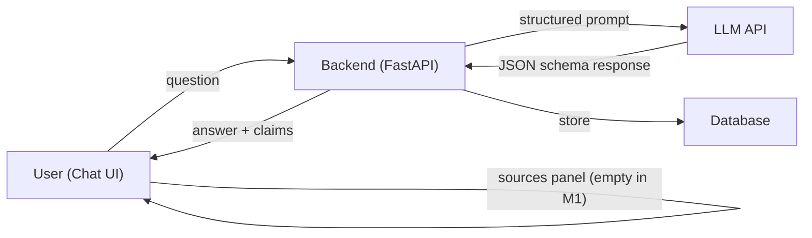

# Problem Statement: AI Nutrition Assistant Prototype (Milestone 1)

---

## 1. Context & Background

Users frequently ask Large Language Models (LLMs) questions regarding food, nutrition, and food safety. However, LLMs often **invent facts** or provide **shifting numbers** across different runs. Because a wrong answer in the nutrition space reads exactly like a right one, users rarely verify the claims, leading to **potential health risks**.

---

## 2. Objective

To build the **foundational prototype** of an AI Nutrition Assistant chatbot that answers questions about food, nutrition, and food safety. For **Milestone 1**, the system will answer entirely from the model's own memory (*without* RAG/retrieval). The primary goal is to establish the **complete architecture** (frontend, backend, schema, and guardrails) so that **Milestone 2** can seamlessly slide a retrieval layer underneath to turn invented claims into cited, verified ones.

---

## 3. Core Requirements

### 3.1 Chat Frontend

A user interface featuring a **message list**, an **input box**, and a dedicated **"sources" panel** next to the conversation. The sources panel will remain **empty** for Milestone 1.

### 3.2 Backend & Storage

- A **chat endpoint** to handle requests.
- **Secure server-side execution** of the model call (no browser-based model calls).
- A **database** to store conversations.

### 3.3 Response Schema

The LLM must return **structured output** (JSON/Schema) rather than prose. The schema must enforce:

| Field              | Description                                          |
| ------------------ | ---------------------------------------------------- |
| `answer`           | The answer text                                      |
| `claims`           | A list of individual claims extracted from the answer |
| `claims[].text`    | The text of the claim                                |
| `claims[].source`  | The source backing the claim                         |

> **Milestone 1 Constraint:** Every `source` field must return as `null`.

### 3.4 System Prompt

A robust set of instructions defining:

- The assistant's **role**.
- Response **formatting** and **length**.
- **Strict boundaries** on topics it cannot touch (see §4).

---

## 4. Scope Limits & Guardrails (Code-Enforced)

The assistant must **strictly refuse** to provide:

1. **Calorie or weight targets** — e.g., *"How many calories should I eat?"*
2. **Recommendations regarding what a person should weigh** — e.g., *"What is my ideal weight?"*
3. **Medical advice** — e.g., *"Should I take this supplement for my condition?"*

> **Constraint:** These limits must be enforced via **application logic/code**, not just reliant on the system prompt.

---

## 5. Failure Logging & Testing

### 5.1 Test Suite

Define **10 test questions** across **4 categories**:

| #  | Category                        | Example Focus                                  |
| -- | ------------------------------- | ---------------------------------------------- |
| 1  | Nutrient requirements           | Daily intake values, vitamin/mineral needs     |
| 2  | Food safety and storage         | Shelf life, temperature guidelines             |
| 3  | Cooking methods                 | Nutrient retention, safe cooking temps         |
| 4  | Ambiguous / unanswered topics   | Edge cases, questions the model should decline |

### 5.2 Failure Log

Run all questions and record a **Failure Log** documenting:

- **Unbacked claims** stated as fact.
- **Shifting numbers/metrics** across multiple runs of the same prompt.
- **Fake citations** (fabricated sources).
- **Guardrail failures** (answering when it should have declined).
- **Hedged, useless answers** (over-qualified responses with no actionable content).

> **Important:** Do **not** hardcode fixes for these failures; they must simply be recorded as a **baseline** for Milestone 2 comparisons.

---

## 6. Deployment & Tech Stack Requirements

| Component      | Options                                            |
| -------------- | -------------------------------------------------- |
| **Model**      | Anthropic API or OpenAI API (Structured Output)    |
| **Frontend**   | Next.js or React                                   |
| **Backend**    | FastAPI                                            |
| **Database**   | Supabase, Postgres, or SQLite                      |
| **Deployment** | Vercel or Railway (must be live at a public URL)   |
| **VCS**        | Code pushed to GitHub                              |

---

## Architecture Overview

---

## Milestone Roadmap

| Milestone   | Focus                                                                 |
| ----------- | --------------------------------------------------------------------- |
| **M1**      | Full architecture + LLM-memory-only answers + failure baseline        |
| **M2**      | Retrieval layer (RAG) to populate `claims[].source` with real citations |
